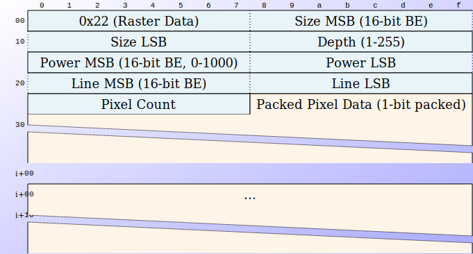

= ADR-010: Bytefield Protocol Diagrams

== Status

Accepted

== Context

K6 protocol has binary packets: opcodes, sizes, depths, powers, pixel data. Need RFC-style diagrams showing byte layout proportionally.

Current state: Manual ASCII art in AsciiDoc. Not sourced from structured data. Duplication between docs and code.

Goal: Structured packet spec → visual diagram. Readable spec. Easy visual check.

.Options
* Protocol (Python CLI) - ASCII from command-line string
* Bytefield-SVG (npm) - SVG from Clojure DSL or JSON
* PacketDiag (Python) - PNG/SVG from text DSL
* Ditaa (Java) - PNG from ASCII art
* PlantUML Salt - PNG/SVG from PlantUML syntax
* LaTeX bytefield - PDF/PNG from LaTeX
* Manual ASCII in AsciiDoc - What we have now

== Decision

Use **Bytefield-SVG** with Docker container.

Documentation: https://bytefield-svg.deepsymmetry.org/bytefield-svg/1.11.0/intro.html

== Rationale

*SVG output:* Scales perfectly. Professional appearance. GitHub renders inline.

*JSON input:* Version controlled packet specs. Single source of truth. Readable by humans and tools.

*Podman container:* No Node.js on Pi required. Build once, run anywhere. Consistent environment. Podman = Docker-compatible, rootless, Flatpak-friendly via `host-spawn`.

*Active maintenance:* Bytefield-SVG actively developed. Well-documented. Good examples.

*Workflow:* Write JSON spec → run container → generate SVG → commit both. Spec in git, diagram regenerated on change.

Considered keeping ASCII but SVG quality justifies container complexity. Container is lightweight (Node.js Alpine ~50MB).

Alternative (PacketDiag) rejected: Python 2 legacy, DSL not JSON, uncertain maintenance.

Alternative (Protocol CLI) rejected: ASCII only, command-line specs not version controlled.

== Implementation

Docker container: `docker-bytefield/`

Generate script: `scripts/generate_diagrams.sh`

Packet specs: `images/*.json`

Output diagrams: `images/*.svg`

Container build:
[source,bash]
----
cd docker-bytefield
host-spawn podman build -t bytefield-svg .
----

Generate diagrams:
[source,bash]
----
scripts/generate_diagrams.sh
----

Or direct:
[source,bash]
----
host-spawn podman run --rm -v $(pwd)/images:/diagrams:Z bytefield-svg input.json -o output.svg
----

Flatpak users: Uses `host-spawn podman` to access host system's podman. No extensions needed.

== Consequences

=== Protocol (Python CLI)

*Input:* Command-line string `"Field:bits,Field2:bits"`

*Output:* ASCII art

*Pros:*
- Simple syntax
- Python (in stack)
- Works immediately
- Good for ad-hoc diagrams

*Cons:*
- No structured input file
- ASCII only (no proportional rendering)
- Last updated 7 years ago
- Spec not version controlled separately

*Example:*
[source,bash]
----
protocol "Opcode:8,Size:16,Depth:8,Power:16,Data:320"
----

=== Bytefield-SVG (npm)

*Input:* Clojure DSL or JSON

*Output:* SVG

*Pros:*
- Beautiful proportional output
- Active maintenance
- JSON input = version control
- Scales perfectly
- Web + CLI

*Cons:*
- Requires Node.js (not in Pi stack)
- Clojure DSL learning curve
- JSON schema not standardized
- Build step required

*Example JSON:*
[source,json]
----
{
  "fields": [
    {"name": "Opcode", "bits": 8},
    {"name": "Size", "bits": 16}
  ]
}
----

*Link:* https://github.com/Deep-Symmetry/bytefield-svg

=== PacketDiag (Blockdiag)

*Input:* Simple text DSL

*Output:* PNG/SVG/PDF

*Pros:*
- Clean readable syntax
- Python-based
- Part of blockdiag suite
- Proportional output

*Cons:*
- Python 2 legacy
- Maintenance unclear
- Less common than Protocol

*Example:*
[source]
----
packetdiag {
  colwidth = 32
  0-7: Opcode
  8-23: Size
  24-31: Depth
}
----

=== Ditaa (ASCII to Diagram)

*Input:* ASCII art

*Output:* PNG

.Pros:
- PlantUML ecosystem (already using)
- Manual control
- AsciiDoc built-in support

.Cons:
- Manual drawing
- Not proportional by default
- ASCII maintenance overhead

=== PlantUML Salt

*Input:* PlantUML salt syntax

*Output:* PNG/SVG

.Pros:
- Already in toolchain
- Existing `plantuml::` support

.Cons:
- Not designed for packet diagrams
- Limited proportional sizing
- Awkward for protocol work

=== LaTeX bytefield

*Input:* LaTeX markup

*Output:* PDF/PNG

.Pros:
* *Publication quality
* Precise control
* Standard in academia

.Cons:
* LaTeX dependency
* Complex build pipeline
* Overkill for Pi project

=== Manual ASCII (Current)

.Input:
* Hand-written ASCII in AsciiDoc

.Output:
* Text in docs

.Pros:
* Zero dependencies
* Works now
* Full control
* GitHub renders directly

.Cons:
* No structured source
* Duplication (spec in code, diagram in docs)
* Manual alignment
* Not proportional
* Easy to get wrong

== Evaluation Criteria

.Must have:
* Structured input (JSON/YAML/DSL)
* Version controlled
* Readable by humans
* Generates visual output

.Nice to have:
* Python-based (Pi stack)
* Proportional rendering
* Active maintenance
* Single source of truth

.Trade-offs:
* ASCII = simple, ugly
* SVG = beautiful, complex
* Python = in stack
* Node.js = not in stack

== Proposed Path

.Phase 1 (now):
* Keep manual ASCII. Document packets in JSON separately.

.Phase 2 (evaluate):
* Install Node.js. Test Bytefield-SVG. Generate diagrams from JSON.

.Phase 3 (decide):
* If Bytefield-SVG works → adopt. If not → PacketDiag or keep ASCII.

== Open Questions

* Worth Node.js dependency for SVG output?
* JSON schema: own format vs Bytefield-SVG format?
* Generate on build vs commit generated images?
* Single JSON with all packets vs one per packet?

== Consequences

.Positive
* Beautiful proportional SVG diagrams
* JSON specs = single source of truth
* Version controlled packet definitions
* No Node.js dependency on Pi (containerized)
* Regenerate diagrams from specs anytime
* GitHub renders SVG inline

.Negative
* Docker build step required
* Slightly more complex than manual ASCII
* Must maintain JSON schema
* Generated files in git (or regenerate on build)

.Trade-off accepted:
* Diagram quality and structured specs outweigh Docker complexity.

== Alternatives Considered

.See full analysis above. Key rejections:
* **Protocol (Python CLI):** ASCII only, no structured source
* **PacketDiag:** Python 2 legacy, DSL not JSON
* **Manual ASCII:** Works but no structured source, duplication
* **LaTeX bytefield:** Overkill, complex build
* **PlantUML Salt:** Not designed for protocol work

Bytefield-SVG chosen for: best output quality, JSON input, active maintenance, Docker solves Node.js dependency.

== Example: K6 Raster Packet Diagram

.K6 Raster Data Packet (0x22) Specification
[source,clojure]
----
include::../images/k6-prot-tx-22-data.edn[]
----

.Generated K6 Raster Packet Diagram

