= K6 Protocol Reference (Complete)
ifdef::flag-book[]
:imagesdir-saved: {imagesdir}
:localdir-saved: {localdir}
:imagesdir: ./images
:localdir: ./documentation
endif::flag-book[]
ifndef::flag-book[]
:toc: right
:toclevels: 5
:sectnums:
:sectnumlevels: 5
ifdef::github-env[]
:icons: font
:tip-caption: :bulb:
:note-caption: :information_source:
:important-caption: :heavy_exclamation_mark:
:caution-caption: :fire:
:warning-caption: :warning:
endif::github-env[]
:imagesdir: ../images
:localdir: .
endif::flag-book[]
//SWD

This file consolidates all K6 protocol documentation: runtime commands, job header parameters, and firmware update protocol.

== Overview & Safety

=== Scope

This documents the *observed* K6 protocol from the vendor macOS Java app.
It is not final. It is the current best-known set of commands for raster mode and partial vector mode.

=== Safety Warning

Laser safety first. Do not run tests unattended. Use eye protection and a fire-safe surface.

[WARNING]
====
Recent tests caused runaway motion:

* Single-line raster test drove into X limit for >10s, moved Y, returned to top-left and kept pushing.
* Init-only test (`0x24` twice) moved X+ then X- then X+ and kept pushing.
* After power-cycle, the device resumed motion immediately.

Treat this as a runaway state. Be ready to power off immediately and avoid repeat until the command sequence is verified.
====

== Vendor Specs & Hardware

=== Specification

.Specification of K6 engraving&cutting machine
* Product Name: Wainlux K6 Mini Laser Engraving Machine
* Brand: Wainlux
* Rated power: 3W
* Product weight: 0.96kg
* Product size: 167x167x165mm
* Engraving area: 80x80mm (vendor spec)
* Supported OS: Windows/MAC/IOS/Android
* Support format: JPEG/JPG/PNG/BMP
* Vendor page: link:https://www.wainlux.com/products/wainlux-k6-mini-laser-engraving-machine?variant=40305160192086[]

=== Hardware Details

* Engraving area: 80x80mm (vendor spec)
* Observed Y-axis: 76mm (4mm shortfall, needs calibration investigation)
* USB: CP2102 serial (10c4:ea60)
* Protocol: Custom (NOT GRBL)
* Baud: 115200

=== Coordinates & Units

* Origin: Top-left
* Units: Pixels
* X: Left to right (0-1066 max)
* Y: Top to bottom (0-1066 max)

=== Resolution and Limits

* **Hardware resolution: 0.05 mm/pixel (FIXED BY FIRMWARE)**
* Work area: 80mm ÷ 0.05 = 1600 pixels
* **Max raster: 1600x1600 pixels** (observed and verified.. and now thrown into doubt after measuring bounds shortfall on Y axis)
* Alternative resolutions documented (0.0625, 0.075, 0.08, 0.096 mm/pixel) **do not work correctly**
* K3 limits (different): 1600x1520px (for reference only - NOT K6.... or maybe are!!)
* Depth: 1-255 (laser on time, default 10)
* Power: 0-1000 (UI value x 10, default 1000)
* Repeat count: 1-10 (default 1)

[WARNING]
====
**Firmware uses fixed 0.05 mm/px resolution regardless of image size.**

Test results (26-Jan-2026):

* 0.05 mm/px, 10mm target (200px) → 10mm actual ✓
* 0.08 mm/px, 10mm target (125px) → 6mm actual (125px × 0.05 = 6.25mm)

The stepper motor step size is hardware-defined. Sending different pixel counts does not change physical resolution - the firmware always interprets pixels as 0.05mm spacing.

**For accurate dimensions: always use 0.05 mm/px (1600×1600 = 80×80mm)**
====

=== ACK Protocol

.K6 ACK Response (0x09) (`k6-prot-rx-09-ack.edn`)

//[source,clojure]
//----
//include::../images/k6-prot-rx-09-ack.edn[]
//----

.K6 Error Response (0x08) (`k6-prot-rx-08-error.edn`)

//[source,clojure]
//----
//include::../images/k6-prot-rx-08-error.edn[]
//----

* ACK byte: `0x09` (success)
* Error byte: `0x08` (failure)
* Most commands expect ACK (timeout 1-3s)
* Exceptions: Job header (0x23) does not wait for ACK
* Status frames: `FF FF 00 XX` for progress reporting

.Data chunk timing sequence
image::data-chunk-timing.png[Data chunk timing showing ACK responses and 100ms pauses]

Each data chunk (opcode `0x23`) requires ACK `0x09` before sending next chunk. 100ms pause after motion commands.

=== USB Serial Setup

.pyserial setup
[source,python]
----
import serial

ser = serial.Serial(
    port='/dev/ttyUSB0',
    baudrate=115200,
    timeout=2
)
----

* Device: /dev/ttyUSB0
* Baud: 115200
* Binary protocol (not text-based)
* Checksum: see <<Checksum Algorithm>>

=== Vector vs Raster
The first "vector" test of a small circle went well *AND* it's clear that the circle was burnt line by line (raster) and *not* as a vector (continuous line).

The first raster tests also went well and also went line by line.

Vector mode on the K6 does not draw continuous lines.
It burns line-by-line. Same as raster.
You send point coordinates. The device converts them to a bitmap. Then it burns the bitmap. Horizontally. Line by line.
The only difference: data format. Vector sends x,y pairs. Raster sends pixels. Both burn the same way.
Why use vector? Fewer bytes for simple shapes. That's all.
Vector on K6 = vector-defined raster.

==== Raster or Vector. Not both.
Each JOB_HEADER command specifies either raster or vector parameters. Not both.
The header sets the mode. One mode per job. That's the limit.

== Runtime Commands

=== Status

* Protocol is partially confirmed by live tests on the Pi.
* Raster mode commands are the most complete.
* Vector mode is partially understood (point list in job data), not yet verified.

=== Live Verification (Pi)

Test run: `test_mvp_mac_proto.py` on `pi-hostname` (Raspbian armv6).

Confirmed:

* `0xFF` version returns 3 bytes (example: `04 01 06`).
* `0x0A` connect ACKs with `0x09` (twice).
* `0x17` home ACKs with `0x09`.
* `0x21` framing ACKs with `0x09`.
* `0x24` init/status returns `ff ff 00 00`.

Not confirmed:

* `0x22` job data timed out on a single long chunk in this run.
	Likely needs chunking or pacing (observed: 1900-byte chunks with retry on timeout).

KISS single-line test (1600x1, no padding):

* Responses were `ff ff ff fe` for version/connect/home/framing in this run.
* `0x22` data timed out.
* `0x24` init timed out once, then returned `ff ff ff fe`.

Interpretation: device likely in a bad state. Power-cycle is recommended before retry.

=== Command Summary

[%header,cols="1,2,2,2,2,3",stripes=even]
|===
| Opcode | Name | Cmd Length | ACK/Response | Discovery | Notes
| `0xFF` | Version | 4 | 3-byte reply | Observed | Request: `ff 00 04 00`, Response: major, minor, patch
| `0x0A` | Connect | 4 | `0x09` | Observed | Sent twice before job data
| `0x06` | Crosshair ON | 4 | `0x09` | Ghidra via LLM | Enable positioning laser (no observable effect)
| `0x07` | Crosshair OFF | 4 | `0x09` | Ghidra via LLM | Disable positioning laser (no observable effect)
| `0x16` | Stop/Cancel | 4 | `0x09` | Ghidra via LLM | Cancel current operation (unreliable)
| `0x17` | Home | 4 | `0x09` | Observed | Move to origin (0,0)
| `0x20` | Set Bounds | 11 | `0x09` | Ghidra via LLM | Enable preview mode - trace bounds outline
| `0x21` | Framing/box | 4 | `0x09` | Observed | Disable preview mode - stop bounds tracing
| `0x23` | Job header | 38 | none waited | Observed | Starts a job
| `0x22` | Job data | variable | `0x09` | Observed | Chunked payload + checksum
| `0x24` | Init/status | 11 | status frame | Observed | Sent after job data
| `0x25` | Set Speed/Power | 11 | `0x09` | Ghidra via LLM | Configure speed and power
| `0x28` | Set Focus/Angle | 11 | `0x09` | Ghidra via LLM | Set focus and angle params
|===

=== Response Frames

==== ACK / Error Byte

* `0x09` = OK
* `0x08` = error

==== Heartbeat Frame (Processing)

.K6 Heartbeat Frame (`k6-prot-rx-heartbeat.edn`)
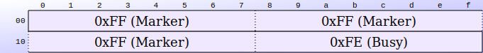

//[source,clojure]
//----
//include::../images/k6-prot-rx-heartbeat.edn[]
//----

`FF FF FF FE` - sent every ~4 seconds while device processes a job header or large command.

* Observed after JOB_HEADER (0x23) - device sends 7 heartbeats over ~28s
* No ACK follows heartbeat frames
* Indicates device is busy calculating/preparing job

==== Status Frame (Progress)

.K6 Status Frame (`k6-prot-rx-status.edn`)
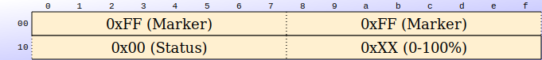

//[source,clojure]
//----
//include::../images/k6-prot-rx-status.edn[]
//----

`FF FF 00 XX` where `XX` is a progress percentage (0-100).

* Sent during burn operation

=== Packet Formats

==== Connect (0x0A)

.K6 Connect Command (0x0A) (`k6-prot-tx-0a-connect.edn`)
image::../images/k6-prot-tx-0a-connect.svg[K6 Connect Command,align="center"]

//[source,clojure]
//----
//include::../images/k6-prot-tx-0a-connect.edn[]
//----

Sent twice with 500 ms delay between sends.

**After JOB_HEADER:** Two CONNECTs serve different purposes:
- **CONNECT #1**: Flushes heartbeat buffer (gets 2-3 heartbeats + ACK)
- **CONNECT #2**: Clean communication (gets immediate ACK)

The JOB_HEADER triggers continuous heartbeats that stream in background. First CONNECT drains these, second gets clean channel.

**State Management:**
- *Not required* for movement commands (BOUNDS, JOG, HOME work without CONNECT)
- *Not enforced* by firmware - device accepts commands when "disconnected"
- *Recommended* at session start to establish sane device state
- *Not tracked* by device - connection is client-side concept only

==== Version (0xFF)

.K6 Version Query (0xFF)
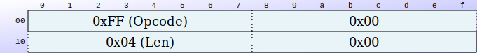

//[source,clojure]
//----
//include::../images/k6-prot-tx-ff-version.edn[]
//----

Expects a 3-byte reply (example: `04 01 06`).

.K6 Version Response (`k6-prot-rx-version.edn`)
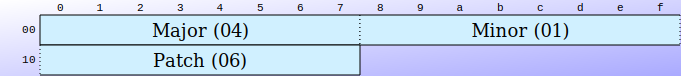

//[source,clojure]
//----
//include::../images/k6-prot-rx-version.edn[]
//----

==== Job Header (0x23)

.K6 Job Header (0x23) (`k6-prot-tx-23-job-header.edn`)
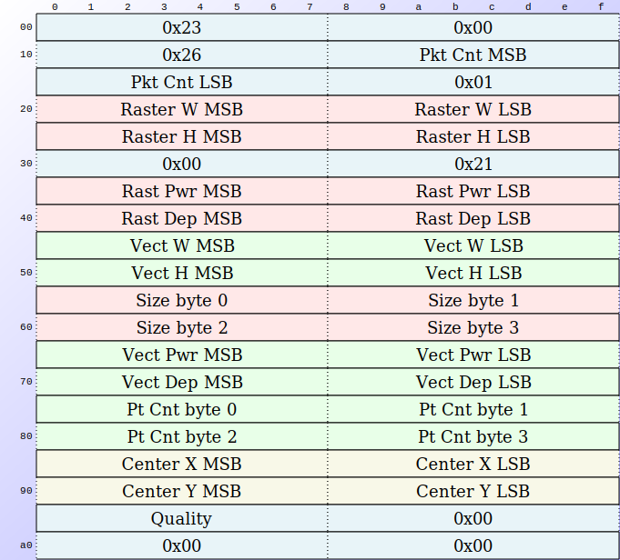

//[source,clojure]
//----
//include::../images/k6-prot-tx-23-job-header.edn[]
//----

Total length: 38 bytes.

Byte layout observed:

* `byte[0] = 0x23`
* `byte[1] = 0x00`
* `byte[2] = 0x26` (38)
* Remaining bytes are parameters (sizes, offsets, settings)
* `byte[37] = 0x00`

Notes:

* **No ACK sent** - device sends heartbeat frames instead
* **Heartbeat frames** (`FF FF FF FE`) sent every ~4 seconds continuously
* Device does NOT stop sending heartbeats - they continue indefinitely
* First heartbeat arrives ~4.7s after sending JOB_HEADER
* Proceed to next command after receiving first heartbeat
* Parameters include width, height, position, and speed/power settings.
* All multi-byte fields are *big-endian* (MSB first).
* Raster width/height are raw pixel dimensions (no scaling applied).
* Raster depth default = `10` (not `1`).
* Center offsets use +67 formula (see <<Job Header Parameters>>).
* Work area observed: 80x80mm, resolution 0.075 mm/pixel ⇒ max ≈ `1067 x 1067` px.

See <<Job Header Parameters>> for complete byte-level mapping.

==== Job Data (0x22)

.K6 Job Data (0x22) (`k6-prot-tx-22-data.edn`)
image::../images/k6-prot-tx-22-data.svg[K6 Job Data,align="center"]

//[source,clojure]
//----
//include::../images/k6-prot-tx-22-data.edn[]
//----

Chunk size: 1900 bytes of payload.

Packet layout (per chunk):

* `byte[0] = 0x22`
* `byte[1] = length >> 8`
* `byte[2] = length`
* `byte[3..N-2] = payload`
* `byte[N-1] = checksum` (see <<Checksum Algorithm>>)

Observed retry behavior: chunk is retransmitted if ACK not received.

Live test note:

* A single long chunk timed out on Pi.
* Use 1900-byte chunks with retry on timeout.

==== Init/Status (0x24)

.K6 Init/Status Command (0x24) (`k6-prot-tx-24-init.edn`)
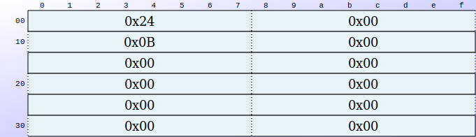

//[source,clojure]
//----
//include::../images/k6-prot-tx-24-init.edn[]
//----

11-byte packet, sent twice after job data:

* `byte[0] = 0x24`
* `byte[1] = 0x00`
* `byte[2] = 0x0B`
* Remaining bytes are zero

This triggers or accompanies the `ff ff 00 xx` status frames.

==== Crosshair (0x06, 0x07)

Toggle positioning laser/LED for alignment:

.K6 Crosshair ON (0x06) (`k6-prot-tx-06-crosshair-on.edn`)
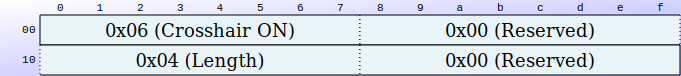

//[source,clojure]
//----
//include::../images/k6-prot-tx-06-crosshair-on.edn[]
//----

.K6 Crosshair OFF (0x07) (`k6-prot-tx-07-crosshair-off.edn`)
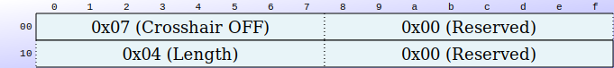

//[source,clojure]
//----
//include::../images/k6-prot-tx-07-crosshair-off.edn[]
//----

* *Purpose:* Enable/disable positioning laser for alignment before burning
* *Length:* 4 bytes each
* *ACK:* Expected (0x09, timeout 2s)
* *Usage:* Send 0x06 to enable, 0x07 to disable
* *Observed Behavior:* No visible effect observed in testing - purpose unclear
* *Status:* Available for testing but not used in production sequences
* *Discovery:* Ghidra analysis via LLM via MCP

==== Stop/Cancel (0x16)

Stop current operation immediately:

.K6 Stop/Cancel Command (0x16) (`k6-prot-tx-16-stop.edn`)
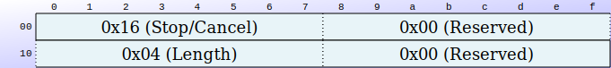

//[source,clojure]
//----
//include::../images/k6-prot-tx-16-stop.edn[]
//----

* *Purpose:* Cancel active engraving/motion
* *Length:* 4 bytes
* *ACK:* Expected (0x09, timeout 2s)
* *Usage:* Critical safety feature - should be easily accessible
* *Observed Behavior:* Unreliable for state clearing - device may not fully reset
* *Note:* Use explicit mode-exit commands (0x21 FRAMING) instead of relying on STOP for state management
* *Discovery:* Ghidra analysis via LLM via MCP

==== Home (0x17)

Return to home position:

.K6 Home Command (0x17) (`k6-prot-tx-17-home.edn`)
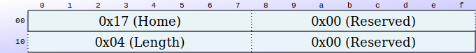

//[source,clojure]
//----
//include::../images/k6-prot-tx-17-home.edn[]
//----

* *Purpose:* Move to origin/home position
* *Length:* 4 bytes
* *ACK:* Expected (0x09, timeout 10s)
* *Usage:* Initialize position before operations

==== Framing (0x21)

Draw boundary frame:

.K6 Framing Command (0x21) (`k6-prot-tx-21-framing.edn`)
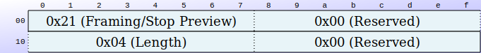

//[source,clojure]
//----
//include::../images/k6-prot-tx-21-framing.edn[]
//----

* *Purpose:* Stop preview mode / draw boundary box for work area preview
* *Length:* 4 bytes
* *ACK:* Expected (0x09, timeout 2s)
* *Behavior:* When sent after 0x20 BOUNDS command, stops continuous preview tracing and returns laser head to center position specified in BOUNDS command (NOT origin)
* *Usage:* 
** Sent before burn sequence to disable bounds checking/preview mode
** To return to origin (0,0) after stopping preview, must send 0x17 HOME after 0x21 FRAMING
** Called "preview OFF" - counterpart to 0x20 BOUNDS which is "preview ON"
* *Note:* 0x20 starts preview loop, 0x21 stops it

==== Set Bounding Box (0x20)

.K6 Set Bounding Box (0x20) (`k6-prot-tx-20-bounds.edn`)
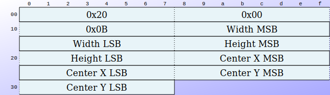

//[source,clojure]
//----
//include::../images/k6-prot-tx-20-bounds.edn[]
//----

Configure bounding box for framing area:

* *Purpose:* Set bounding box for selection/framing area, starts preview mode
* *Length:* 11 bytes
* *ACK:* Expected (0x09, timeout 1s)
* *Behavior:* Enables preview mode - laser traces bounds outline (called "framing ON" or "preview ON")
* *Parameters:*
** Bytes 3-4: width (16-bit BE)
** Bytes 5-6: height (16-bit BE)
** Bytes 7-8: center_x (16-bit BE)
** Bytes 9-10: center_y (16-bit BE)
* *Note:* Uses same +67 centering formula as job header (see <<Job Header Parameters>>)
* *Discovery:* Ghidra analysis via LLM via MCP

==== Set Speed/Power (0x25)

.K6 Set Speed/Power (0x25) (`k6-prot-tx-25-speed-power.edn`)
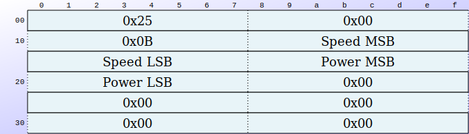

//[source,clojure]
//----
//include::../images/k6-prot-tx-25-speed-power.edn[]
//----

Configure speed and power settings:

* *Purpose:* Set speed and power (separate from job header)
* *Length:* 11 bytes
* *ACK:* Expected (0x09, timeout 2s)
* *Parameters:*
** Bytes 3-4: speed (16-bit BE)
** Bytes 5-6: power (16-bit BE)
** Bytes 7-10: reserved (zeros)
* *Note:* Precedence vs job header values needs hardware testing
* *Discovery:* Ghidra analysis via LLM via MCP

==== Set Focus/Angle (0x28)

.K6 Set Focus/Angle (0x28) (`k6-prot-tx-28-focus.edn`)
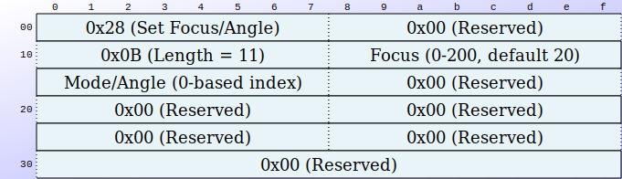

//[source,clojure]
//----
//include::../images/k6-prot-tx-28-focus.edn[]
//----

Configure focus/angle parameters:

* *Purpose:* Set focus and angle parameters
* *Length:* 11 bytes
* *ACK:* Expected (0x09, timeout 2s)
* *Parameters:*
** Byte 3: focus parameter (default 20, range 0-200, typically UI_value x 2)
** Byte 4: mode/angle index (0-based, purpose unclear)
** Bytes 5-10: reserved (zeros)
* *Note:* "Weak light power" - likely crosshair/positioning laser intensity
* *Note:* Actual effect needs hardware testing
* *Discovery:* Ghidra analysis via LLM via MCP

=== Raster Bit Packing

Observed pixel packing:

* Pack 8 pixels per byte with masks: `[-128, 64, 32, 16, 8, 4, 2, 1]`.
* Use the red channel as threshold.
* If $R < 10$, set the bit.

=== Vector Mode (Partial)

The job payload can include point data after the raster payload:

* Points are appended as pairs of 16-bit values (x, y).
* Each point contributes 4 bytes: `x_lo, x_hi, y_lo, y_hi`.
* Observed in packet structure analysis.

Vector mode is not confirmed on hardware yet.

=== Opcode 0x1c

* Seems to be limited to K3. Not seen on wire.

=== Verification Plan (Pi)

Run only with safety precautions.

* Use `test_mvp_mac_proto.py` for the known-good opcode sequence.
* Verify ACK bytes (`0x09`) for:
** `0x0A` connect
** `0x17` home
** `0x21` framing
** `0x22` job data chunks
** `0x06/0x07` crosshair toggle
** `0x16` stop/cancel
** `0x20` set bounds
** `0x25` set speed/power
** `0x28` set focus/angle
* Confirm version read returns 3 bytes for `0xFF`.
* Confirm status frames `ff ff 00 xx` after `0x24`.
* For vector mode, build a tiny payload with only point data and observe movement.
* Test framing (0x21) before actual burn to verify bounds
* Test stop (0x16) during operation for safety validation
* Test speed/power (0x25) precedence vs job header values
* Test focus/angle (0x28) to understand effect on positioning laser (if any)

== Job Header Parameters

This section documents the complete 38-byte job header (opcode 0x23) parameter mapping.

=== Parameter Structure

Header parameters observed:
----
Packet count:        (33 + raster_bytes + vector_bytes) / 4094 + 1
Version/mode:        1
Raster width:        pixel width
Raster height:       pixel height
Raster offset:       33 (constant)
Raster power:        0-1000 (default 1000)
Raster depth:        1-255 (default 10)
Vector width:        vector bounding box width
Vector height:       vector bounding box height
Vector offset:       33 + raster_size
Vector power:        0-1000 (default 1000)
Vector depth:        1-255 (default 10)
Vector point count:  number of points
Raster center X:     x + width/2 + 67
Raster center Y:     y + height/2
Repeat count:        1-10 (default 1)
Vector center X:     x + width/2 + 67
Vector center Y:     y + height/2
----

*Centering Formula:*

* Raster and vector both use: `center_x = x + width/2 + 67`, `center_y = y + height/2`
* The +67 offset is consistent for all centering operations

=== Header Byte Layout

[cols="1,3,4",options="header"]
|===
| Byte(s) | Field | Description
| [0-2] | Header | 0x23, 0x00, 0x26 (opcode, zero, length 38)
| [3-4] | Packet count | 16-bit big-endian
| [5] | Version/mode | Always 1
| [6-7] | Raster width | Pixel width, 16-bit BE
| [8-9] | Raster height | Pixel height, 16-bit BE
| [10-11] | Raster offset | Data offset, 16-bit BE (always 33)
| [12-13] | Raster power | 0-1000, 16-bit BE (default 1000)
| [14-15] | Raster depth | 1-255, 16-bit BE (default 10)
| [16-17] | Vector width | Bounds width, 16-bit BE
| [18-19] | Vector height | Bounds height, 16-bit BE
| [20-23] | Vector offset | Data offset, 32-bit BE = 33 + raster_size
| [24-25] | Vector power | 0-1000, 16-bit BE (default 1000)
| [26-27] | Vector depth | 1-255, 16-bit BE (default 10)
| [28-31] | Vector points | Point count, 32-bit BE
| [32-33] | Raster center X | 16-bit BE = x + width/2 + 67
| [34-35] | Raster center Y | 16-bit BE = y + height/2
| [36] | Repeat count | 1-10 (default 1)
| [37] | Reserved | Always 0
|===

*Note:* Bytes 32-35 are raster center coordinates. Vector centers are NOT in the header - they appear to be used for calculations but not transmitted.

=== Default Values Observed

* Raster power: default 1000 (range 0-1000, observed via UI: value x 10)
* Raster depth: default 10 (range 1-255)
* Vector power: default 1000 (range 0-1000, observed via UI: value x 10)
* Vector depth: default 10 (range 1-255)
* Contrast/threshold: default 50 (range 0-100)
* Fill density: default 5 (range 0-10)
* Crosshair power: default 20 (range 0-200, observed via UI: value x 2)

=== Work Area and Resolution

Resolution options observed (mm/pixel):

* 0.05, 0.0625, *0.075* (default), 0.08, 0.096, 0.064

Default: 0.075 mm/pixel

* 80mm ÷ 0.075 = 1066.67 pixels (~1067)
* Max safe raster: 1066x1066 pixels (observed limit)

[source,python]
----
# Raster image center (bytes 32-35 in header)
raster_center_x = raster_bbox.x + (raster_bbox.width // 2) + 67
raster_center_y = raster_bbox.y + (raster_bbox.height // 2)

# Vector graphics center (used in calculations, NOT in header)
vector_center_x = vector_bbox.x + (vector_bbox.width // 2) + 67
vector_center_y = vector_bbox.y + (vector_bbox.height // 2)
----

=== Packet Count Calculation

[source,python]
----
packet_count = ((33 + raster_bytes + vector_bytes) // 4094) + 1
----

Where:

* 33 = header size
* `raster_bytes` = raster data size (width x height in bytes for 1-bit packed)
* `vector_bytes` = vector data size (4 bytes per point)
* 4094 = max chunk size

=== Key Findings

* All multi-byte fields are *big-endian* (MSB first)
* Raster data offset is always 33 (header size)
* Vector data offset = 33 + raster_data_size (32-bit field)
* Raster offset is 16-bit, vector offset is 32-bit
* Vector point count is 32-bit
* Bytes 32-35 are raster center coordinates
* Byte 36 is repeat count (1-10)
* Vector centers calculated but NOT transmitted in header
* Center coordinate parameters need testing to determine exact behavior

== Firmware Update Protocol

This section documents the IAP (In-Application Programming) bootloader protocol for K6 firmware updates.

image::firmware-update.png[Firmware Update Sequence]

=== Protocol Overview

* *Port:* Same as runtime (see <<USB Serial Setup>>)
* *Baud:* 115200 (same as runtime)
* *Mode:* Bootloader-only (device must be reset to enter IAP mode)
* *Firmware:* ROM.bin (28072 bytes observed)
* *Checksum:* See <<Checksum Algorithm>>

=== Command Sequence

==== 1. Connect to Bootloader

.Packet:
----
0x0A 0x00 0x04 0x00
----

.Response:
----
0x09 (ACK)
----

.Notes:
* Same opcode as runtime connect
* Bootloader identified by context (device in IAP mode)
* Timeout: 400ms per port attempt

==== 2. Reset MCU (Enter IAP Mode)

.K6 Reset MCU (0xFE) (`k6-prot-tx-fe-reset-mcu.edn`)

//[source,clojure]
//----
//include::../images/k6-prot-tx-fe-reset-mcu.edn[]
//----

.Response:
----
0x09 (ACK)
----

.Checksum:
* See <<Checksum Algorithm>> in Common Elements section

.Notes:
* Resets MCU to bootloader mode
* Wait for ACK within 1s
* After reset, device is in bootloader mode

==== 3. Set Speed (Optional)

.K6 Set Speed (0x02) (`k6-prot-tx-02-set-speed.edn`)
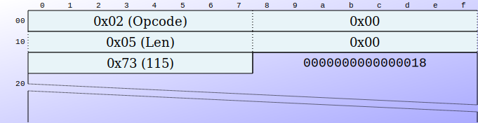

//[source,clojure]
//----
//include::../images/k6-prot-tx-02-set-speed.edn[]
//----

.Response:
* None observed

.Notes:
* Default value: 115 (purpose unclear - probably not baud rate)
* Sent before flashing begins
* 5 second delay after command observed

==== 4. Flash Firmware Blocks

.K6 Flash Firmware Block (0x03) (`k6-prot-tx-03-flash-block.edn`)
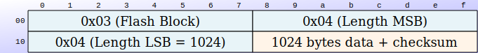

//[source,clojure]
//----
//include::../images/k6-prot-tx-03-flash-block.edn[]
//----

.Packet structure:
----
[0]      = 0x03 (opcode)
[1-2]    = 0x04 0x04 (length 1024, big-endian)
[3-1026] = 1024 bytes of firmware data (padded with 0xFF)
[1027]   = checksum (two's complement)
----

.Total packet size:
* 1027 bytes (3 header + 1024 data + 1 checksum)

.Response:
----
0x09 (ACK) - required per block
----

.Process:
. Read firmware file
. Calculate block count: (file_size + 1023) // 1024
. For each block:
** Build 1024-byte block (pad with 0xFF if needed)
** Prepend header: 0x03 0x04 0x04
** Append checksum
** Send packet
** Wait for ACK 0x09
** Update progress: (block_index / total_blocks) x 100%

.Example: 
* ROM.bin 28072 bytes = 28 blocks (last block: 28072 % 1024 = 40 bytes data + 984 bytes 0xFF padding)

==== 5. Completion

.Observed behavior:
* No explicit "done" command
* Device auto-reboots after last block ACK
* Close serial port
* Device returns to runtime firmware

=== Firmware Update Summary

[cols="1,2,3,2",options="header"]
|===
| Opcode | Name | Packet Format | Response
| 0x0A | Connect | `0x0A 0x00 0x04 0x00` | 0x09 (ACK)
| 0xFE | Reset MCU | `0xFE 0x00 0x05 0x00 [chk]` | 0x09 (ACK)
| 0x02 | Set Speed | `0x02 0x00 0x05 0x00 0x73` | None
| 0x03 | Write Block | `0x03 0x04 0x04 [1024 bytes] [chk]` | 0x09 (ACK)
|===

=== Implementation Notes

.Known:
* Connect sequence: 0x0A with 400ms timeout
* Reset to bootloader: 0xFE with checksum (see <<Checksum Algorithm>>)
* Speed command: 0x02, value 115 (purpose unclear)
* Write block format: 0x03 + length + 1024 bytes + checksum
* Block padding: 0xFF for incomplete blocks
* ACK handling: 0x09 required per block
* Progress calculation: (block_index / total_blocks) x 100%

.Unknowns:
* Bootloader entry method from runtime (power-cycle? hardware button?)
* What "speed 115" parameter controls
* Firmware signature/validation
* Rollback protection or version checking
* Device response if firmware corrupted

.Safety:
* Test on non-production device first
* Ensure firmware is valid before flashing
* Do not interrupt flashing process

== Common Elements

=== Checksum Algorithm

Checksum algorithm (used for job data and firmware update):

. Sum all bytes except the last.
. If sum $> 255$, do $sum = \sim sum + 1$.
. Return $sum \& 0xFF$.

This is a 1-byte two's-complement checksum.

=== Status Reporting

* No dedicated status request opcode observed.
* Progress is reported asynchronously from the device as `FF FF 00 XX` frames.
* Progress can be monitored by listening for this pattern on the serial port.

== Open Questions & Sources

=== Open Questions

* Full parameter meaning for the 38-byte job header.
* Exact semantics of `0x24` (init vs status vs end-of-job).
* Vector-only job format and minimal valid payload.
* Whether `0x0A` must be sent twice in all cases.
* Speed/Power (0x25) precedence - does it override job header values?
* Focus/Angle (0x28) mode/angle index meaning and effect
* Crosshair (0x06/0x07) relationship to focus parameter (0x28)
* Bootloader entry method from runtime (power-cycle? hardware button?)
* What "speed 115" parameter controls in firmware update
* Firmware signature/validation

=== Sources

* Existing working scripts in `scripts/`
* Ghidra analysis via MCP/LLM for additional opcodes

ifdef::flag-book[]
:imagesdir: {imagesdir-saved}
:localdir: {localdir-saved}
endif::flag-book[]
